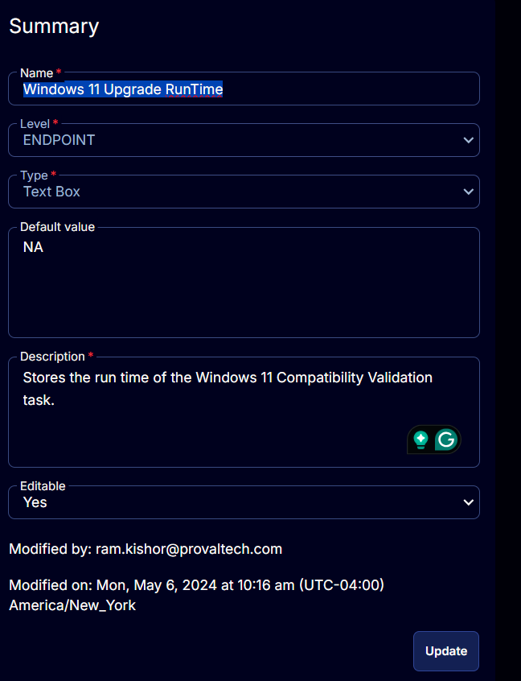

## Summary

This document outlines the storage of the runtime for the Windows 11 Compatibility Validation task.

## Details

| Field Name                       | Level    | Type      | Default Value | Description                                                   | Editable |
|----------------------------------|----------|-----------|---------------|---------------------------------------------------------------|----------|
| Windows 11 Upgrade Runtime       | Endpoint | Text Box  | NA            | Stores the runtime of the Windows 11 Compatibility Validation task. | Yes      |

## Screenshot

  

