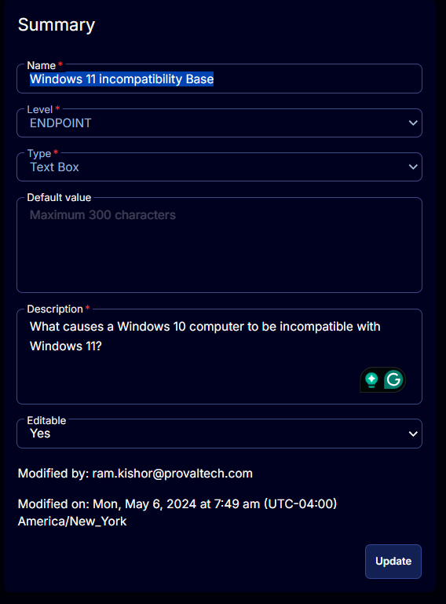

## Summary

Stores the result returned by the [Windows 11 Compatibility Validation](<../tasks/Windows 11 Compatibility Validation.md>) task for the incompatible machines.

## Details

| Field Name                            | Level    | Type      | Default Value | Description                                                            | Editable |
|---------------------------------------|----------|-----------|---------------|------------------------------------------------------------------------|----------|
| Windows 11 Incompatibility Base       | Endpoint | Text Box  |               | What causes a Windows 10 computer to be incompatible with Windows 11? | Yes      |

## Screenshot

  

