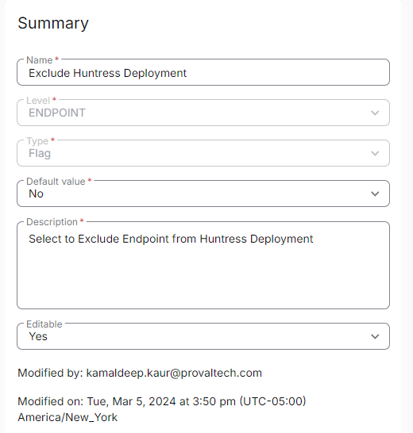

## Summary

Select this custom Field to exclude a machine from Huntress Deployment. It is being utilized by [CW RMM - Device Group - Deploy Huntress](https://proval.itglue.com/DOC-5078775-15302736) group.

# Create the Custom Field

**Name:** Exclude Huntress  
**Type:** Flag  
**Level:** Endpoint  
**Description:** Select to Exclude Endpoint from Huntress Deployment  
**Editable:** Yes  

