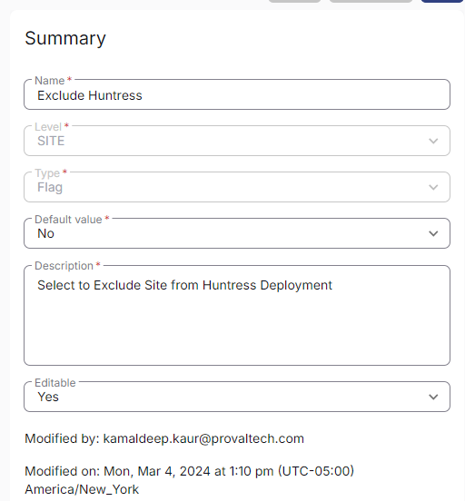

## Summary

Select this custom Field to exclude a site from Huntress Deployment. It is being utilized by '[CW RMM - Device Group - Deploy Huntress](https://proval.itglue.com/DOC-5078775-15302736)' group.

# Create the Custom Field

**Name:** Exclude Huntress  
**Type:** Flag  
**Level:** Site  
**Description:** Select to Exclude Site from Huntress Deployment  
**Editable:** Yes  

