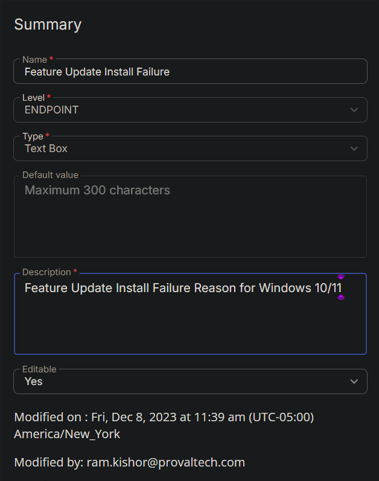

## Summary

The `Feature Update Install With Tracking` task utilizes this custom field to store the reason for failure in case the installation of the latest feature update is unsuccessful.

# Create the Custom Field

**Name:** Feature Update Install Failure  

**Type:** Text Box  

**Level:** Endpoint  

**Description:** Feature Update Install Failure Reason for Windows 10/11  

**Editable:** Yes  

