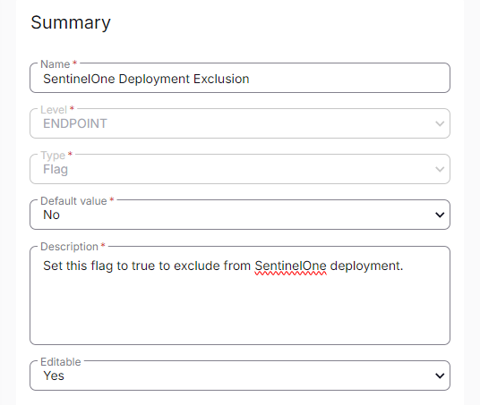

## Summary

Set this custom flag to true to exclude an endpoint from SentinelOne deployment.

## Dependencies

[CW RMM - Solution - SentinelOne Deployment](<../../solutions/SentinelOne Deployment.md>)

## Details

| Field Name                              | Level   | Type | Default Value | Description                                                      | Editable |
|-----------------------------------------|---------|------|---------------|------------------------------------------------------------------|----------|
| SentinelOne Deployment Exclusion        | Endpoint| Flag | No            | Set this flag to true to exclude from SentinelOne deployment.    | Yes      |

## Screenshot

