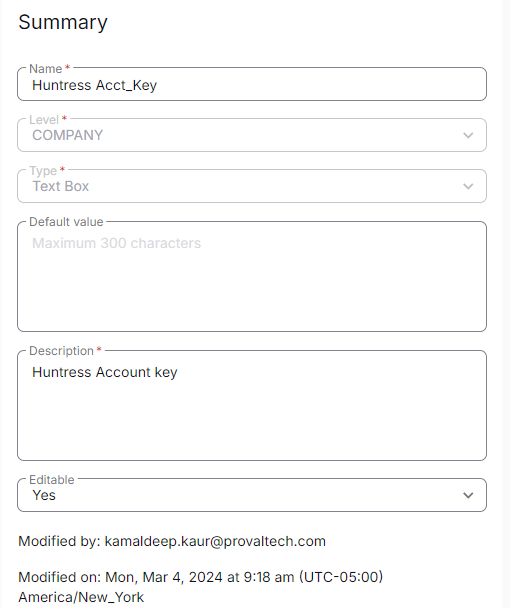

## Summary

This Custom field is to be filled with Huntress Account Key by the partner. It is being utilized by [CW RMM - Device Group - Deploy Huntress](https://proval.itglue.com/DOC-5078775-15302736) task.

# Create the Custom Field

**Name:** Huntress Acct_Key  
**Type:** Text Box  
**Level:** Company  
**Description:** Huntress Account key  
**Editable:** Yes  

