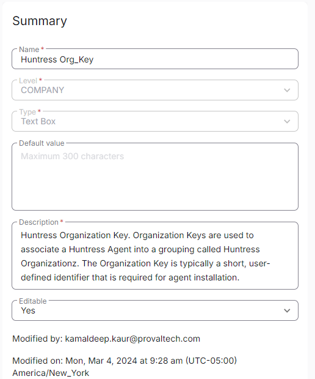

## Summary

This custom field is to be filled with the Huntress Organization Key. It is utilized by the [CW RMM - Task - Huntress Agent (INSTALL)](<../tasks/Huntress Agent (INSTALL).md>) task, which essentially corresponds to the Client Name.

## Create the Custom Field

**Name:** Huntress Org_Key  
**Type:** Text Box  
**Level:** Company  
**Description:** The Huntress Organization Key is used to associate a Huntress Agent with a grouping called Huntress Organizations. The Organization Key is typically a short, user-defined identifier that is required for agent installation.  
**Editable:** Yes  
