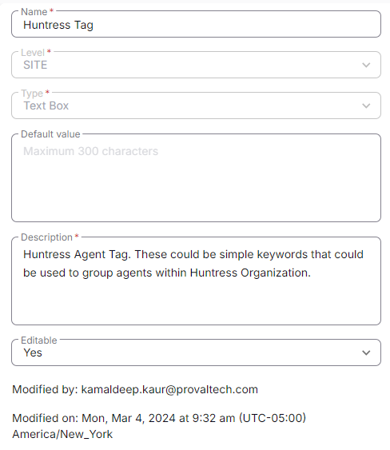

## Summary

This Custom field is to be filled with Huntress Tag. It is being utilized by [CW RMM - Task - Huntress Agent (INSTALL)](https://proval.itglue.com/DOC-5078775-13684933) task. Basically the Location Name.

# Create the Custom Field

**Name:** Huntress Tag  
**Type:** Text Box  
**Level:** Site  
**Description:** Huntress Agent Tag. These could be simple keywords that could be used to group agents within Huntress Organization.  
**Editable:** Yes  

