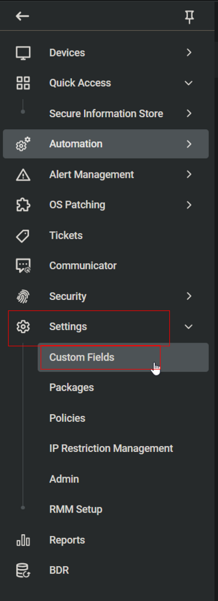
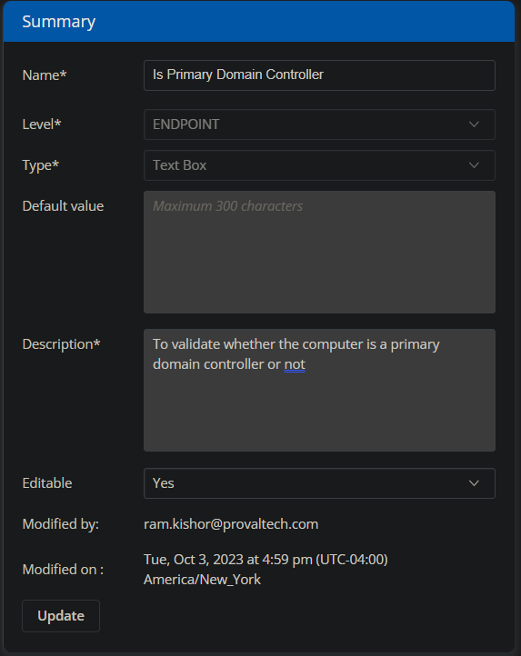

## Summary

This document describes how to validate whether a computer is a primary domain controller. The check is performed by the [CW RMM - Task - Validate Primary Domain Controller](<../tasks/Validate Primary Domain Controller.md>) task.

The custom field is then used to create the [CW RMM - Machine Group - Infrastructure Master](<../groups/Infrastructure Master.md>) group.

## Dependencies

- [CW RMM - Machine Group - Domain Controllers](<../groups/Domain Controllers.md>)
- [CW RMM - Task - Validate Primary Domain Controller](<../tasks/Validate Primary Domain Controller.md>)

## Details

| Field Name                   | Type of Field (Machine or Organization) | Description                                           |
|------------------------------|-----------------------------------------|-------------------------------------------------------|
| Is Primary Domain Controller   | Machine                                 | To validate whether the computer is a primary domain controller or not |

## Screenshot

  
  
**Name:** Is Primary Domain Controller  
**Description:** To validate whether the computer is a primary domain controller or not.

## Sample Value

