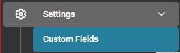
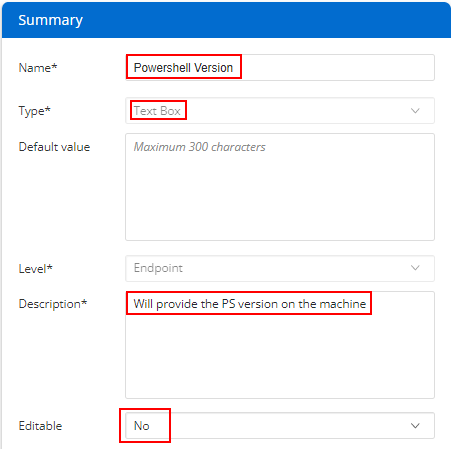

## Summary

This custom field is used to store Windows PowerShell version information about the endpoint. These details are gathered by the [CW RMM - PowerShell Version Information](https://proval.itglue.com/DOC-5078775-12824367) task.

# Create the Custom Field

- **Name:** PowerShell Version
- **Type:** Text Box
- **Default Value:** NULL / LEAVE EMPTY
- **Level:** Endpoint
- **Description:** Will provide the PS version on the machine
- **Editable:** No

