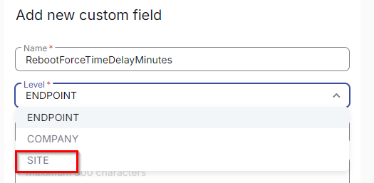
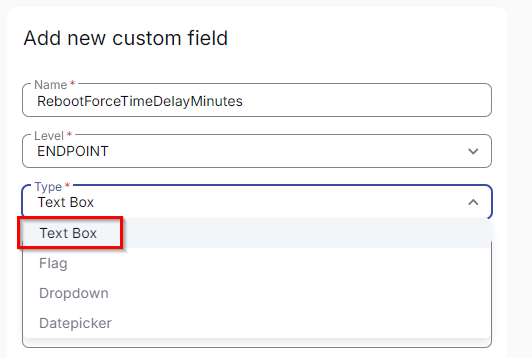
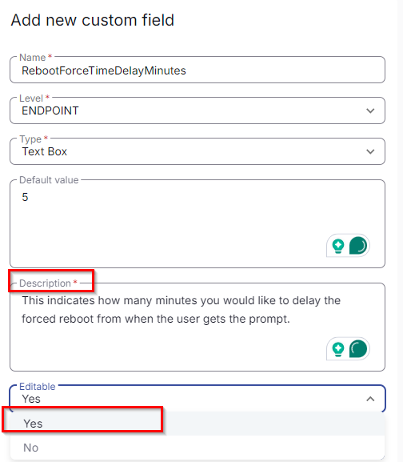
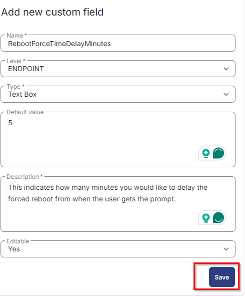

## Summary

The custom fields listed below are used in the Reboot Prompter Solution.

## Dependencies

[CW RMM - Task - Reboot Prompter](/docs/8d171849-b417-4ce7-a75f-c9294aca045b)

## Details

| Name                             | Level    | Type     | Default                                                  | Editable | Description                                                                                                                                                                                                                   |
|----------------------------------|----------|----------|----------------------------------------------------------|----------|-------------------------------------------------------------------------------------------------------------------------------------------------------------------------------------------------------------------------------|
| RebootPromptCount                | Site     | Text Box | 4                                                        | Yes      | How many times the user will be prompted before being forced to reboot? (If it is 4, the user will be forced to reboot on the 5th prompt). The default is set to 4.                                                          |
| RebootForceTimeDelayMinutes      | Site     | Text Box | 5                                                        | Yes      | This indicates how many seconds you would like to delay the forced reboot from when the user gets the prompt. The default is set to 5 minutes.                                                                              |
| Prompter_Title                   | Site     | Text Box | Updates Installed - Reboot Required                      | Yes      | Holds the desired Title Text for the Prompter pop-up. The default value is set to 'Updates Installed - Reboot Required.'                                                                                                   |
| Prompter_Timeout                 | Site     | Text Box | 90                                                       | Yes      | The duration of time you wish the Prompter pop-up to remain on the user's screen before auto-closing. The default value is set to 90 seconds.                                                                                |
| Prompter_Icon                    | Site     | Text Box | [https://redirhostname/WCC2/Utilities/HeaderImage](https://redirhostname/WCC2/Utilities/HeaderImage) | Yes      | Holds the local path and file or URL to a desired pop-up icon. The default is set to '[https://redirhostname/WCC2/Utilities/HeaderImage](https://redirhostname/WCC2/Utilities/HeaderImage)'                               |
| Prompter_HeaderImage             | Site     | Text Box | [https://redirhostname/WCC2/Utilities/HeaderImage](https://redirhostname/WCC2/Utilities/HeaderImage) | Yes      | Holds the local path, file, or URL to a desired pop-up header image. The default is set to '[https://redirhostname/WCC2/Utilities/HeaderImage](https://redirhostname/WCC2/Utilities/HeaderImage)'                       |
| Prompter_RebootPending           | Endpoint | Flag     | No                                                       | Yes      | This flag is manually set at the endpoint level to enable the reboot prompter solution. It will be automatically unchecked if the agent is restarted by the Task 'Reboot Prompter'.                                         |
| Auto_RebootPendingCheck          | Endpoint | Flag     | No                                                       | No       | This flag is automatically set at the endpoint level via task to enable the reboot prompter solution. It will be automatically unchecked if the agent is restarted by the Task 'Reboot Prompter'.                           |
| Prompter_Counter                 | Endpoint | Text Box |                                                          | No       | This fetches the number of attempts the reboot prompt made on the user machine from the text file 'Prompter_Counter' created by the task [CW RMM - Task - Reboot Prompter](/docs/8d171849-b417-4ce7-a75f-c9294aca045b) after complete execution. |
| Prompter_Logging                 | Endpoint | Text Box |                                                          | No       | This fetches the logging details where the denial and threshold counts are provided. It also contains information on the force reboot log from the text file 'Prompter_Logging' created by the task [CW RMM - Task - Reboot Prompter](/docs/8d171849-b417-4ce7-a75f-c9294aca045b) after complete execution. |
| Prompter_UserAction              | Endpoint | Text Box |                                                          | No       | This fetches the user action details indicating whether the user clicked 'No', 'Yes', or 'Time Lapsed', along with the date and time to show when the action was taken from the text file 'Prompter_UserAction' created by the task [CW RMM - Task - Reboot Prompter](/docs/8d171849-b417-4ce7-a75f-c9294aca045b) after complete execution. |
| Exclude Reboot                   | Endpoint | Flag     | No                                                       | Yes      | This will exclude the endpoint from the Reboot Prompter solution.                                                                                                                                                             |

## Steps to Create Custom Fields

1. Go to **Settings > Custom Fields**  
   

2. Click **Add** option  
   

3. Create Custom Field  
   Provide Name: **RebootForceTimeDelayMinutes**  
   Select Level: **Site**  
     
   Then check the Type option:  
   Type: **Text Box**  
     
   Then provide Default Value and Description:  
   Default: **5**  
   Description: This indicates how many minutes you would like to delay the forced reboot from when the user gets the prompt.  
   Editable: **Yes**  
     
   **Note:** Description is mandatory to be filled and it doesn't accept *'NEW LINE'.* Write everything in one phrase to describe the detail of the custom field.

4. Click **Save**  
   Once all details are filled, click **Save**, and the custom field will be created.  
   

5. Repeat the above four steps to create all other custom fields based on the Name, Level, Type, Default, Description, and Editable options provided in the table.

