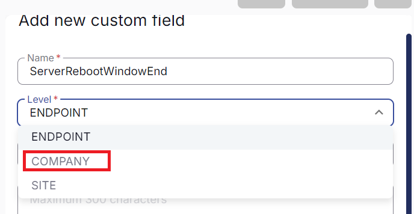
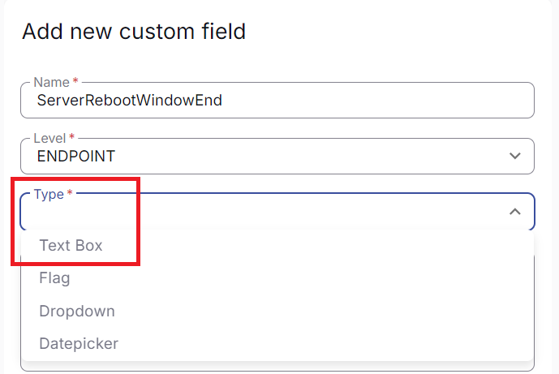
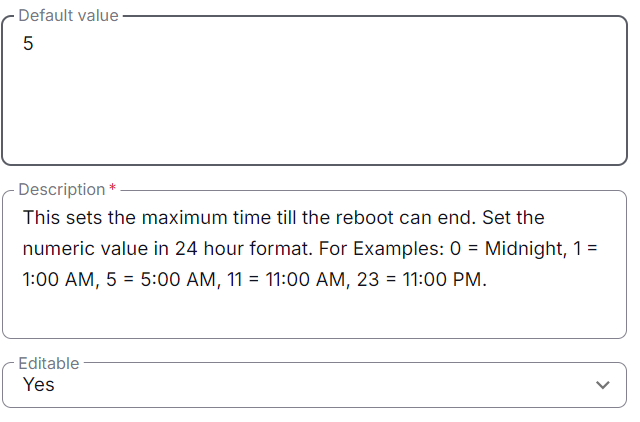
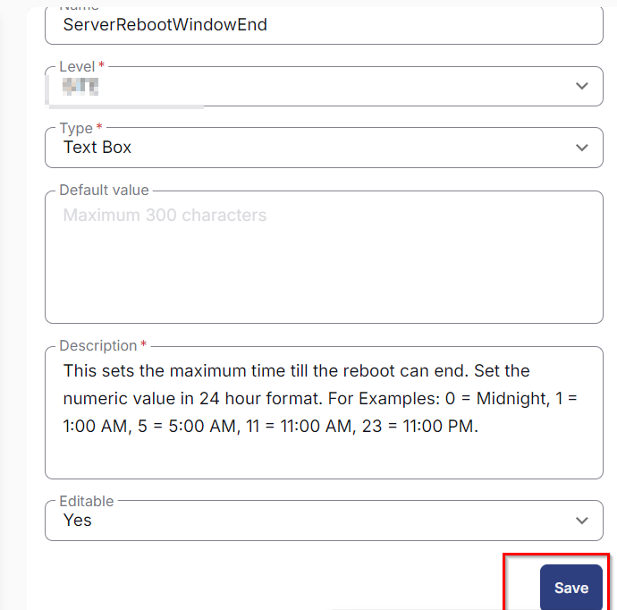

## Summary

The custom fields listed below are used in the Reboot Schedule Solution.

## Dependencies

## Details

| Name                           | Level   | Type      | Default | Editable | Description                                                                                                                                                                                                                     |
|--------------------------------|---------|-----------|---------|----------|---------------------------------------------------------------------------------------------------------------------------------------------------------------------------------------------------------------------------------|
| WorkstationRebootWindowStart   | Company | Text Box  | 1       | Yes      | This sets the minimum time when the reboot can start for workstations. Set the numeric value in 24-hour format. For example: 0 = Midnight, 1 = 1:00 AM, 5 = 5:00 AM, 11 = 11:00 AM, 23 = 11:00 PM.                       |
| WorkstationRebootWindowEnd     | Company | Text Box  | 5       | Yes      | This sets the maximum time until the reboot can end for workstations. Set the numeric value in 24-hour format. For example: 0 = Midnight, 1 = 1:00 AM, 5 = 5:00 AM, 11 = 11:00 AM, 23 = 11:00 PM.                       |
| WorkstationRebootWindowDay     | Company | Text Box  | 'Monday','Tuesday','Wednesday','Thursday','Friday' | Yes      | Approved reboot day for the workstation. **NOTE:** To exclude this client from the solution, please enter 'Exclude' in the field. This will cause the script to exit and not take any actions on the target device.          |
| ServerRebootWindowStart        | Company | Text Box  | 1       | Yes      | This sets the minimum time when the reboot can start for servers. Set the numeric value in 24-hour format. For example: 0 = Midnight, 1 = 1:00 AM, 5 = 5:00 AM, 11 = 11:00 AM, 23 = 11:00 PM.                          |
| ServerRebootWindowEnd          | Company | Text Box  | 5       | Yes      | This sets the maximum time until the reboot can end for servers. Set the numeric value in 24-hour format. For example: 0 = Midnight, 1 = 1:00 AM, 5 = 5:00 AM, 11 = 11:00 AM, 23 = 11:00 PM.                          |
| ServerRebootWindowDay          | Company | Text Box  | 'Monday','Tuesday','Wednesday','Thursday','Friday' | Yes      | Approved reboot day for the server. **NOTE:** To exclude this client from the solution, please enter 'Exclude' in the field. This will cause the script to exit and not take any actions on the target device.                 |
| Force Reboot                   | Endpoint | Flag     | No      | Yes      | If this flag is checked on the agent, then the reboot will be forced via the Reboot Schedule or Force Reboot script.                                                                                                           |
| Exclude Reboot                 | Endpoint | Flag     | No      | No       | This will exclude the endpoint from the Reboot custom solutions.                                                                                                                                                               |

*Note: The Force Reboot flag has a higher priority than the Exclude Reboot flag.*

*If there is any endpoint where both 'Force Reboot' and 'Exclude Reboot' are checked, then the endpoint will be rebooted or scheduled for reboot if the task is executed.*

## Steps to Create Custom Fields

1. Go to **Settings > Custom Fields**  
   

2. Click the **Add** option  
   

3. Create a Custom Field  
   Provide Name: `ServerRebootWindowEnd`  
   Select Level: `Company`  
     
   Then check the Type option:  
   Type: `Text Box`  
     
   Then provide Default Value and Description:  
   Default: `5`  
   Description: This sets the maximum time until the reboot can end. Set the numeric value in 24-hour format. For example: 0 = Midnight, 1 = 1:00 AM, 5 = 5:00 AM, 11 = 11:00 AM, 23 = 11:00 PM.  
   Editable: `Yes`  
     
   **Note:** The description is mandatory and must be written in one phrase. It does not accept **'NEW LINE'.**

4. Click **Save**  
   Once all details are filled, click **Save**, and the custom field will be created.  
   

5. Repeat the above four steps to create all other custom fields based on the Name, Level, Type, Default, Description, and Editable values provided in the table.  
   **NOTE:** To exclude this client from the solution, please enter 'Exclude' in the field. This will cause the script to exit and not take any actions on the target device.
