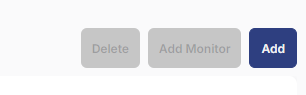
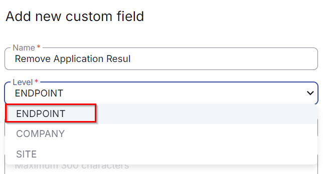
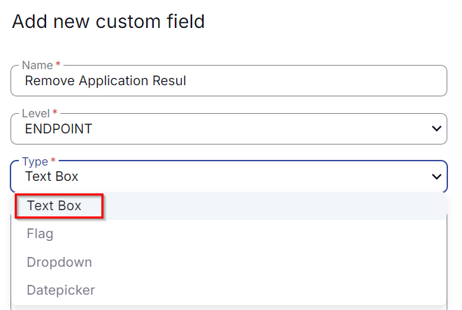
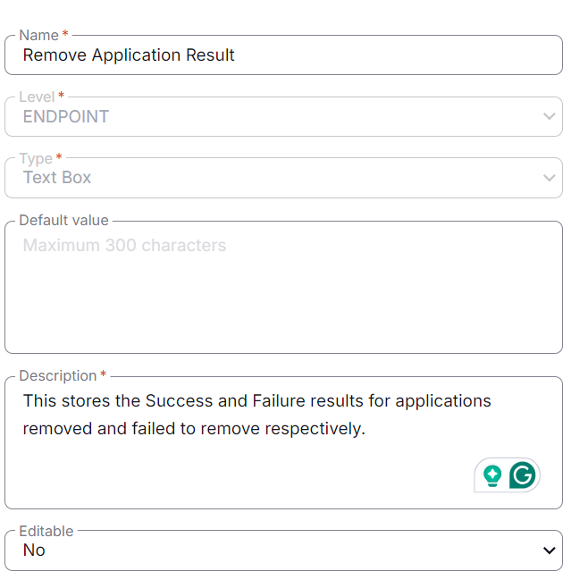

## Summary

The below custom field is used in the "Remove Application" script to gather the success or failure status.

## Dependencies

## Details

| Name                        | Level    | Type  | Default | Editable | Description                                                                                   |
|-----------------------------|----------|-------|---------|----------|-----------------------------------------------------------------------------------------------|
| Remove Application Result    | Endpoint | Text  |         | No       | It stores either 'Success' or 'Failure'. Success: It means the application removed successfully. Failure: It means the application provided failed to remove. |

## Steps to Create Custom Fields

1. Go to Settings > Custom Fields  
   

2. Click Add option  
   

3. Create Custom Field  
   Provide Name: Remove Application Result  
   Select Level: Endpoint  
     
   
   Then check the Type option:  
   Type: Text Box  
     
   
   Then Provide Default Value and Description:  
   Default:   
   Description: This stores the Success and Failure results for applications removed and failed to remove respectively.  
   Editable: No  
     

   Note: Description is mandatory to be filled and it doesn't accept **'NEW LINE'.**  
   Write everything in one phrase to describe the detail of the custom field.

