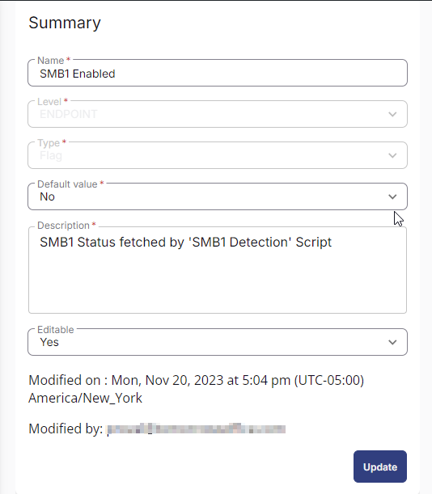
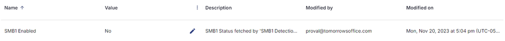

## Summary

This custom field is used to store and display the results of the task [CW RMM - Task - Detect SMB1](https://proval.itglue.com/DOC-5078775-14419758).

## Dependencies

[CW RMM - Task - Detect SMB1](https://proval.itglue.com/DOC-5078775-14419758)

## Details

| Field Name       | Type of Field (Machine or Organization) | Description                                 |
|------------------|-----------------------------------------|---------------------------------------------|
| SMB1 Enabled     | Endpoint                                | SMB1 Status fetched by 'Detect SMB1' Script |

## ScreenShot

## Sample Value

