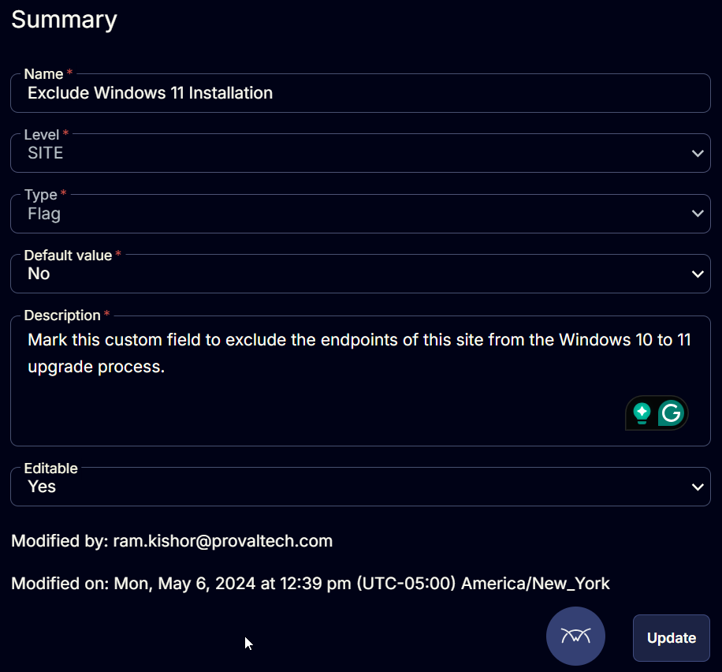

## Summary

Mark this custom field to exclude the endpoints of this site from the Windows 10 to 11 upgrade process.

## Details

| Field Name                          | Level | Type | Default Value | Description                                                                                          | Editable |
|-------------------------------------|-------|------|---------------|------------------------------------------------------------------------------------------------------|----------|
| Exclude Windows 11 Installation     | Site  | Flag | No            | Mark this custom field to exclude the endpoints of this site from the Windows 10 to 11 upgrade process. | Yes      |

## Screenshot

  

