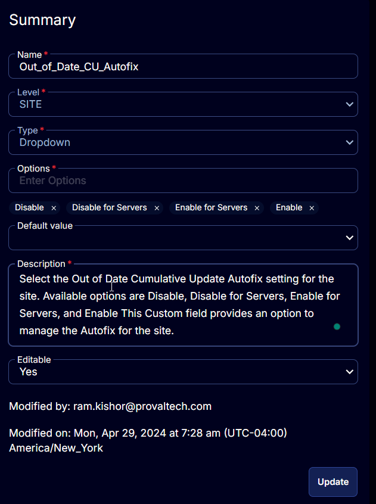

## Summary

Select the Out of Date Cumulative Update Autofix setting for the site. Available options are `Disable`, `Disable for Servers`, `Enable for Servers`, and `Enable`. This Custom field provides an option to manage the Autofix for the site or to override the option set in the company level Custom Field [CW RMM - Custom Field - Company - Out_of_Date_CU_Autofix](https://proval.itglue.com/DOC-5078775-15748259).

## Details

| Field Name                  | Level | Type     | Options                                                                                             | Default Value | Description                                                                                                                                                        | Editable |
|-----------------------------|-------|----------|-----------------------------------------------------------------------------------------------------|---------------|--------------------------------------------------------------------------------------------------------------------------------------------------------------------|----------|
| Out_of_Date_CU_Autofix     | SITE  | Dropdown | `Disable`, `Disable for Servers`, `Enable for Servers`, `Enable`                                 |               | Select the Out of Date Cumulative Update Autofix setting for the site. Available options are Disable, Disable for Servers, Enable for Servers, and Enable. This Custom field provides an option to manage the Autofix for the site. | Yes      |

## Options

| Option                     | Description                                                                                                                                                                                                                     |
|----------------------------|---------------------------------------------------------------------------------------------------------------------------------------------------------------------------------------------------------------------------------|
| Disable                    | To disable the Autofix for the site. It can be used to overwrite the option set at the Company level custom field [CW RMM - Custom Field - Company - Out_of_Date_CU_Autofix](https://proval.itglue.com/DOC-5078775-15748259). It can be overridden from the Endpoint level. |
| Disable for Servers        | To disable the Autofix for the servers of this site. It can be used to overwrite if the `Servers as Well` option is set at the Company level custom field [CW RMM - Custom Field - Company - Out_of_Date_CU_Autofix](https://proval.itglue.com/DOC-5078775-15748259). It can be overridden from the Endpoint level. |
| Enable for Servers         | To enable the Autofix for the servers of this site. It can be used to enable the Autofix for servers of the individual site; if it's disabled for the Company. It can be overridden from the Endpoint level.                     |
| Enable                     | To enable the Autofix for the site. It can be used to enable the Autofix for the individual site; if it's disabled for the Company. To override the `Disable` option selected in the Company level Custom field [CW RMM - Custom Field - Company - Out_of_Date_CU_Autofix](https://proval.itglue.com/DOC-5078775-15748259). It can be overridden from the Endpoint level. |

## ScreenShot

