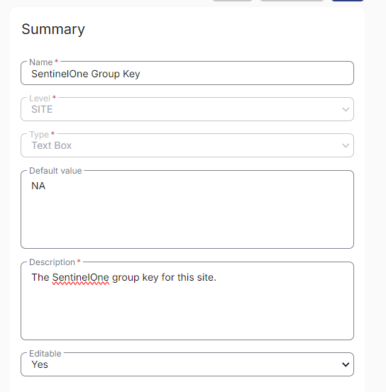

## Summary

This custom field at the site level stores the Sentinel Group Key, which is utilized for grouping and managing endpoints based on logical criteria like departments or security policies. If this custom field is empty, the script will then search for the @SentinelOne Site Key instead.

## Dependencies

[CW RMM - Solution - SentinelOne Deployment](https://proval.itglue.com/DOC-5078775-15822040)

## Details

| Field Name                     | Level | Type     | Default Value | Description                           | Editable |
|--------------------------------|-------|----------|---------------|---------------------------------------|----------|
| SentinelOne Group Key          | Site  | TextBox  | NA            | The SentinelOne group key for this site. | Yes      |

## Screenshot

