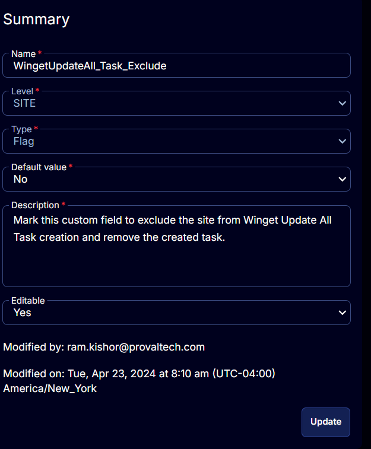

## Summary

Mark this custom field to exclude the site from Winget Update All Task creation and remove the created tasks for the site's Windows 10 and 11 computers.

Marking this custom field will exclude the machines from [CW RMM - Machine Group - Winget Update All (Task Delete)](<../groups/Winget Update All (Task Delete).md>) group. The [CW RMM - Task - Scheduled Task Winget Update All (Create)](<../tasks/Scheduled Task Winget Update All (Create).md>) task will not run on the computers of sites with this custom field marked.

## Details

| Field Name                       | Level | Type | Default Value | Description                                                                                   | Editable |
|----------------------------------|-------|------|---------------|-----------------------------------------------------------------------------------------------|----------|
| WingetUpdateAll_Task_Exclude     | SITE  | Flag | No            | Mark this custom field to exclude the site from Winget Update All Task creation and remove the created task. | Yes      |

## Screenshots

  
  

