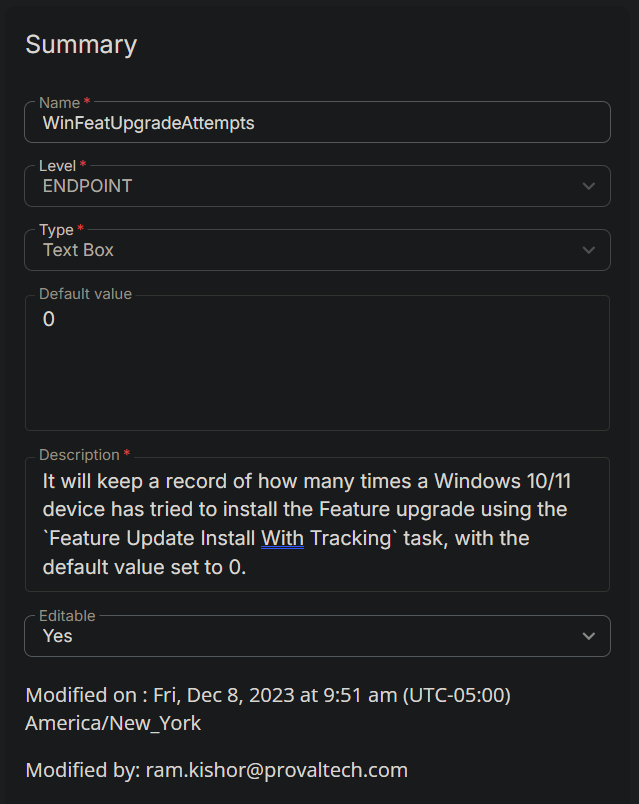

## Summary

It will keep a record of how many times a Windows 10/11 device has tried to install the Feature upgrade using the `Feature Update Install With Tracking` task, with the default value set to 0.

# Create the Custom Field

---

**Name:** WinFeatUpgradeAttempts  
**Type:** Text Box  
**Default Value:** 0  
**Level:** Endpoint  
**Description:** It will keep a record of how many times a Windows 10/11 device has tried to install the Feature upgrade using the `Feature Update Install With Tracking` task, with the default value set to 0.  
**Editable:** Yes  

