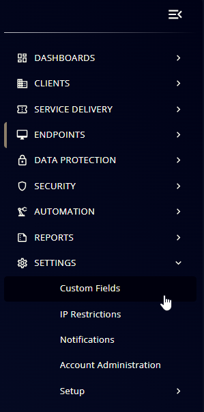

## Summary

## Details

| Name                 | Level                | Type                | Default?         | Required | Editable | Description                              |
|----------------------|----------------------|---------------------|------------------|----------|----------|------------------------------------------|
| Name of Custom Field | Endpoint/Company/Site | Text/Checkbox/Dropdown | blank or Default Value | True/False | Yes/No   | Description of what the CF is designed to do |

## Creation Process

### Step 1

Navigate to `Settings` ➞ `Custom Fields`  

### Step 2

Locate the `Add` button on the right-hand side of the screen and click on it.  

## Completed Custom Field