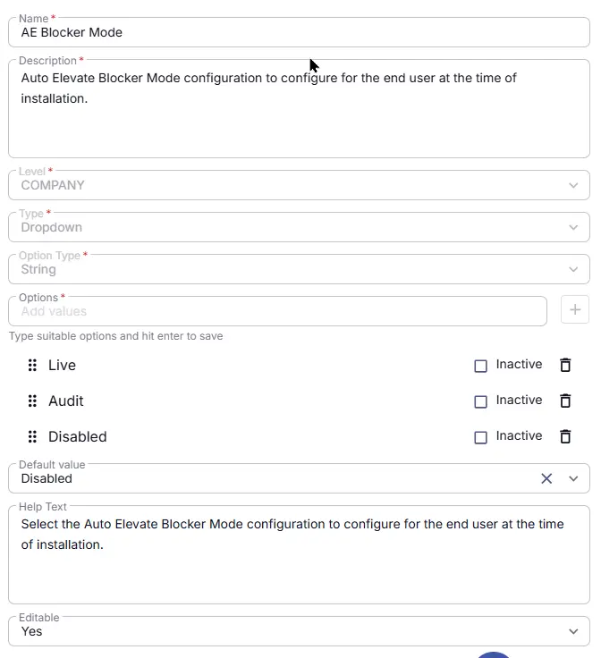

## Summary
Auto Elevate Blocker Mode configuration to configure for the end user at the time of installation. Blocker Mode is a required parameter that needs to be passed during the AutoElevate agent deployment. This parameter is used to set the Blocker Mode configuration for the end user at the time of installation.

## Details

| Name | Description | Level | Type | Option Type | Options | Help Text | Default Value | Editable |
|---|---|---|---|---|---|---|---|---|
| AE Blocker Mode | AutoElevate Blocker Mode configuration to configure for the end user at the time of installation.|  Company | Dropdown | String | `Live`, `Audit`, `Disabled` |  Select the AutoElevate Blocker Mode configuration to configure for the end user at the time of installation. | `Disabled` | `Yes` |

## Dependencies

- [Solution : AutoElevate Deployment](/docs/4a95cdd5-dec1-4d8e-aa3a-0ee4dd7c0273)

## Completed Custom Field

## Changelog

### 2026-08-10

- Initial version of the document
