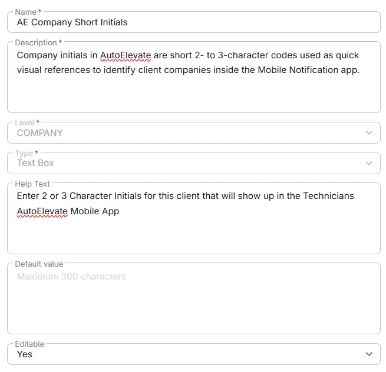

## Summary
Company initials in AutoElevate are short 2- to 3-character codes used as quick visual references to identify client companies inside the Mobile Notification app.

## Details

| Name                 | Level                | Type                | Default       | Editable | Description      |   Help Text                     |
|----------------------|----------------------|--------|------------|------------------|----------|----------|
| AE Company Short Initials | Company| Text |-|  Yes  | Company initials in AutoElevate are short 2- to 3-character codes used as quick visual references to identify client companies inside the Mobile Notification app. | Enter 2 or 3 Character initials for this client that will show up in the technician's AutoElevate mobile app. |

## Dependencies

- [Solution : AutoElevate Deployment](/docs/4a95cdd5-dec1-4d8e-aa3a-0ee4dd7c0273)

## Completed Custom Field

## Changelog

### 2026-08-10

- Initial version of the document

