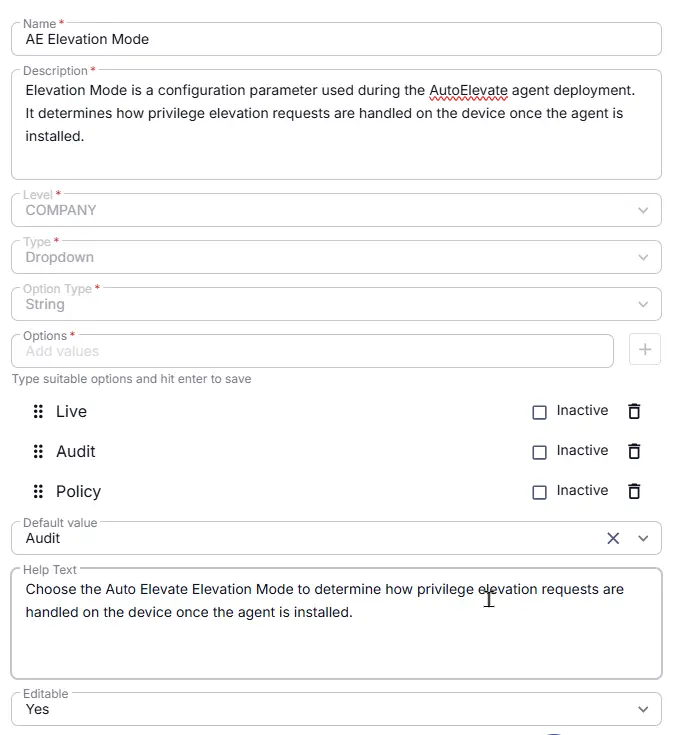

## Summary
Elevation Mode is a configuration parameter used during the AutoElevate agent deployment. It determines how privilege elevation requests are handled on the device once the agent is installed.

## Details

| Name | Description | Level | Type | Option Type | Options | Help Text | Default Value | Editable |
|---|---|---|---|---|---|---|---|---|
| AE Elevation Mode| Elevation Mode is a configuration parameter used during the AutoElevate agent deployment. It determines how privilege elevation requests are handled on the device once the agent is installed.|  Company | Dropdown | String | `Live`, `Audit`, `Policy` |  Choose the AutoElevate Elevation Mode to determine how privilege elevation requests are handled on the device once the agent is installed. | `Audit` | `Yes` |

## Dependencies

- [Solution : AutoElevate Deployment](/docs/4a95cdd5-dec1-4d8e-aa3a-0ee4dd7c0273)

## Completed Custom Field

## Changelog

### 2026-08-10

- Initial version of the document
