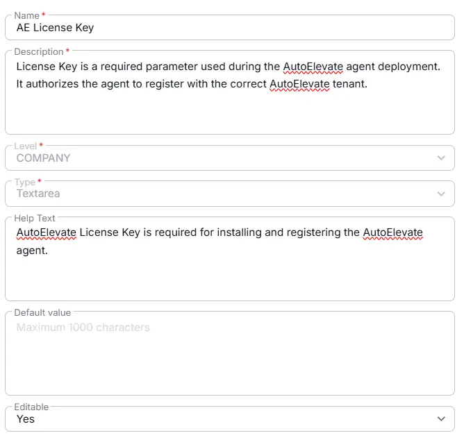

## Summary
License Key is a required parameter used during the AutoElevate agent deployment. It authorizes the agent to register with the correct AutoElevate tenant.

## Details

| Name                 | Level                | Type                | Default       | Editable | Description      |   Help Text                     |
|----------------------|----------------------|--------|------------|------------------|----------|----------|
| AE License Key | Company| Text |-|  Yes  | License Key is a required parameter used during the AutoElevate agent deployment. It authorizes the agent to register with the correct AutoElevate tenant.| AutoElevate License Key is required for installing and registering the AutoElevate agent. |

## Dependencies

- [Solution : AutoElevate Deployment](/docs/4a95cdd5-dec1-4d8e-aa3a-0ee4dd7c0273)

## Completed Custom Field

## Changelog

### 2026-08-05

- Initial version of the document

