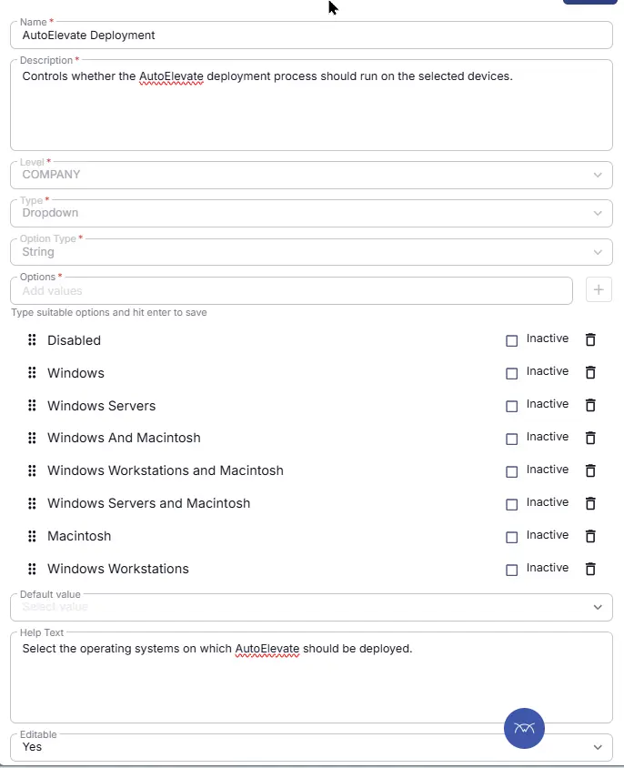

## Summary
Controls whether the AutoElevate deployment process should run on the selected devices.

## Details

| Name | Description | Level | Type | Option Type | Options | Help Text | Default Value | Editable |
|---|---|---|---|---|---|---|---|---|
| AutoElevate Deployment | Custom Field to exclude Endpoint from AutoElevate Deployment. |  Company | Dropdown | String | `Disabled`,`Macintosh`, `All`, `Windows`,  `Win Workstations`,  `Win Workstations and Macintosh` | Select the operating systems on which AutoElevate should be deployed. `All` : Deploys on both macintosh and windows servers and workstations machines. `Windows` : Deploys on both windows servers and workstations. `Win Workstations` : Select this to deploy on just windows workstations. `Win Workstations and Macintosh` : Select this to deploy on windows workstations and Mac machines. `Macintosh` : Select this to deploy on just Mac machines. | - | `Yes` |

## Dependencies

- [Solution : AutoElevate Deployment](/docs/4a95cdd5-dec1-4d8e-aa3a-0ee4dd7c0273)

## Completed Custom Field

## Changelog

### 2026-08-10

- Initial version of the document
