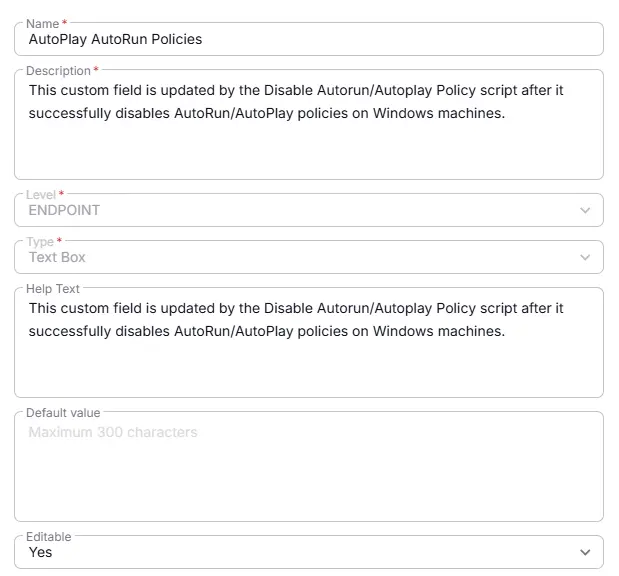

## Summary
This custom field is updated by [Disable Autorun/Autoplay Policy](/docs/6399c6ed-3a31-4d9e-97ce-9ca50780bb92) after it successfully disables AutoRun/AutoPlay policies on Windows machines.

## Details

| Name                 | Level                | Type                | Help Text |  Default       | Editable | Description                              |
|----------------------|----------------------|---------------------|-----------| -------|----------|------------------------------------------|
| AutoPlay AutoRun Policies | Company | Text | This custom field is updated by the `Disable Autorun/Autoplay Policy` script after it successfully disables AutoRun/AutoPlay policies on Windows machines. | - |  Yes | This custom field is updated by the `Disable Autorun/Autoplay Policy script after it successfully disables AutoRun/AutoPlay policies on Windows machines. |

## Dependencies

- [Solution - Disable Autorun/Autoplay policies](/docs/4bfb0532-45a1-41b8-8e69-d552bae1d12d) 

## Completed Custom Field

## Changelog

### 2026-06-25

- Initial version of the document
