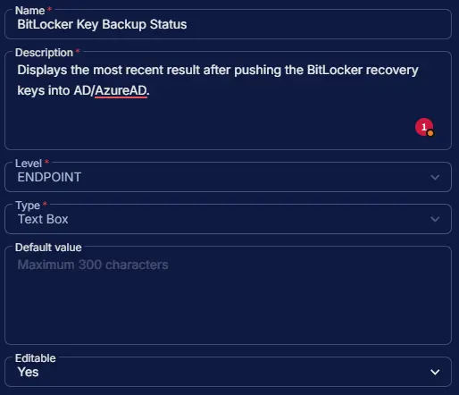

## Summary

This custom field is used to display the results of the [BitLocker Recovery Key Backup](/docs/b469ea90-0c1b-421b-89e2-be5c91501035) task that pushes BitLocker keys from CW RMM to Active Directory or Azure Active Directory.

## Dependencies

- [Task - BitLocker Recovery Key Backup](/docs/b469ea90-0c1b-421b-89e2-be5c91501035)
- [Solution - BitLocker Key Backup](/docs/fecda0ff-5a3e-4cc5-b6a7-fd37732aa2e9)

## Custom Field Setup Location

**Custom Fields Path:** `SETTINGS` ➞ `Custom Fields`  

## Details

| Name | Level | Type | Options | Default Value | Editable | Description |
| ---- | ----- | ---- | ------- | ------------- | -------- | ----------- |
| BitLocker Key Backup Status | ENDPOINT | Text Box | | | Yes | Displays the most recent result after pushing the BitLocker recovery keys into AD/AzureAD. |

## Completed Custom Field

