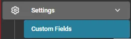
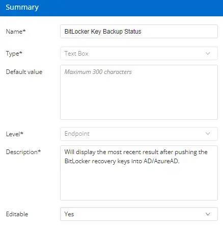

## Summary

This custom field is used to display the results of the [CW RMM - Task - BitLocker Recovery Key Backup Audit](/docs/b469ea90-0c1b-421b-89e2-be5c91501035) task that pushes BitLocker keys from CW RMM to Active Directory or Azure Active Directory.

## Create the Custom Field

  
  

**Name:** BitLocker Key Backup Status  
**Type:** Text Box  
**Default Value:** NULL / LEAVE EMPTY  
**Level:** Endpoint  
**Description:** Will display the most recent result after pushing the BitLocker recovery keys into AD/AzureAD.  
**Editable:** Yes  