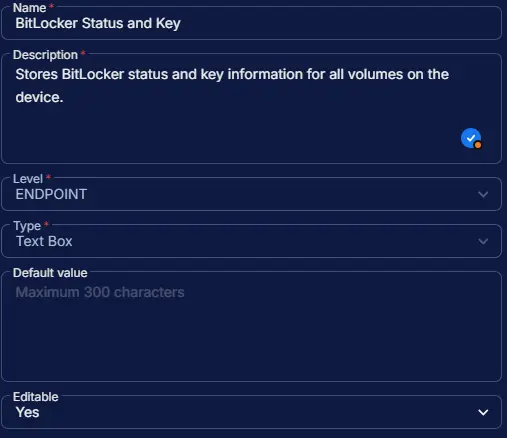

## Summary

This custom field is used to display the BitLocker encryption status of drives based on the [BitLocker Status and Recovery Key Audit](/docs/9682b5a8-d821-43f6-9b77-59d43b6ef015) task. If a recovery key is available, the solution will also write the key to the custom field.

## Dependencies

- [Task - BitLocker Status and Recovery Key Audit](/docs/9682b5a8-d821-43f6-9b77-59d43b6ef015)
- [Solution - BitLocker Status and Recovery Key Audit](/docs/b2a974b2-c231-4197-a639-d0775d77d7c7)

## Custom Field Setup Location

**Custom Fields Path:** `SETTINGS` ➞ `Custom Fields`  

## Details

| Name | Level | Type | Options | Default Value | Editable | Description |
| ---- | ----- | ---- | ------- | ------------- | -------- | ----------- |
| BitLocker Status and Key | ENDPOINT | Text Box | | | Yes | Stores BitLocker status and key information for all volumes on the device. |

## Completed Custom Field

