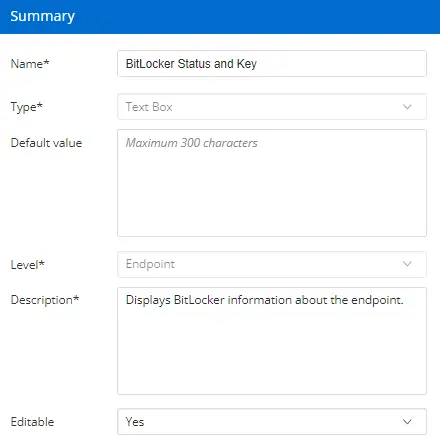

## Summary

This custom field is used to display the BitLocker encryption status of drives based on the [BitLocker Status and Recovery Key Audit](/docs/9682b5a8-d821-43f6-9b77-59d43b6ef015) task. If a recovery key is available, the solution will also write the key to the custom field.

## Create the Custom Field

- **Name:** BitLocker Status and Key
- **Type:** Text Box
- **Default Value:** NULL / LEAVE EMPTY
- **Level:** Endpoint
- **Description:** This will show drives that are encrypted with BitLocker and will display the recovery key if available.
- **Editable:** Yes