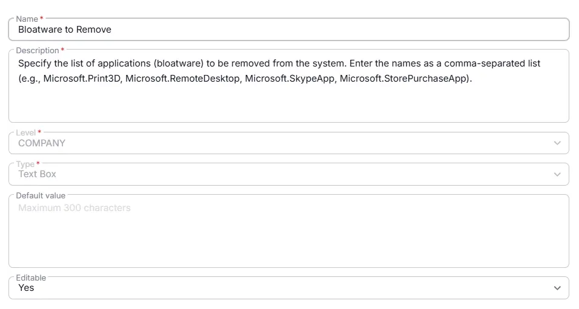

## Summary
This custom field defines which applications will be removed as bloatware. Ensure the names are accurate and comma-separated. 

## Dependencies

- [Solution - Remove Bloatware](/docs/0b1f4077-1cf3-43ea-9c9d-93e2db94e24f)

## Details

| Name                 | Level                | Type                | Default      |  Editable | Description                              |
|----------------------|----------------------|---------------------|------------------|----------|------------------------------------------|
| Bloatware to Remove | Company | Text Box | | Yes  | Specify the list of applications (bloatware) to be removed from the system. Enter the names as a comma-separated list (e.g., Microsoft.Print3D, Microsoft.RemoteDesktop, Microsoft.SkypeApp, Microsoft.StorePurchaseApp). |

## Completed Custom Field

## Changelog

### 2026-03-30

- Initial version of the document
