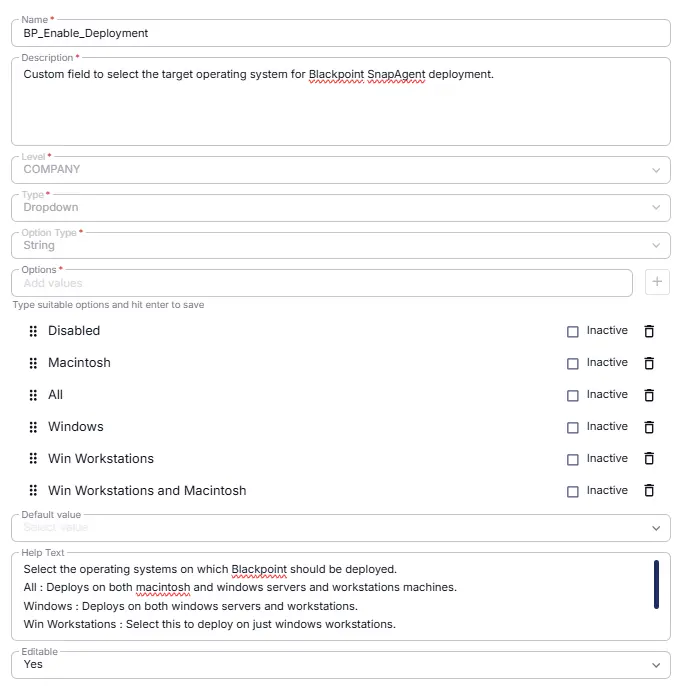

## Summary

Custom field to select the target operating system for BlackPoint SnapAgent deployment.

## Details

| Name | Description | Level | Type | Option Type | Options | Help Text | Default Value | Editable |
|---|---|---|---|---|---|---|---|---|
| BP_Enable_Deployment | Custom field to select the target operating system for BlackPoint SnapAgent deployment. |  Company | Dropdown | String | `Disabled`,`Macintosh`, `All`, `Windows`,  `Win Workstations`,  `Win Workstations and Macintosh` | Select the operating systems on which BlackPoint should be deployed. `All` : Deploys on both macintosh and windows servers and workstations machines. `Windows` : Deploys on both windows servers and workstations. `Win Workstations` : Select this to deploy on just windows workstations. `Win Workstations and Macintosh` : Select this to deploy on windows workstations and Mac machines. `Macintosh` : Select this to deploy on just Mac machines. `Disabled` : Disables the deployment.| - | `Yes` |

## Dependencies

- [Solution - BlackPoint SnapAgent Deployment](/docs/b99808e9-5148-47f6-9da4-bc4eeb590f2a) 

## Completed Custom Field

## Changelog

### 2026-08-25

- Initial version of the document