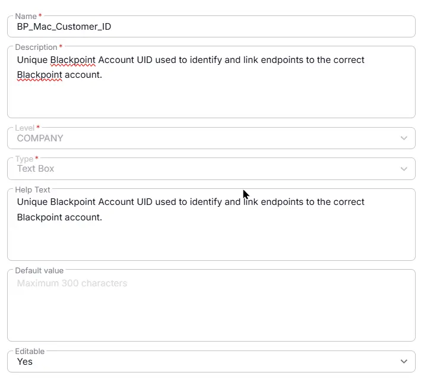

## Summary

Unique BlackPoint Account UID used to identify and link endpoints to the correct BlackPoint account. This is for MAC agents.

## Details

| Name                 | Level                | Type                | Default       | Editable | Description      |   Help Text                     |
|----------------------|----------------------|--------|------------|------------------|----------|----------|
| BP_Mac_Customer_ID | Company| Text |-|  Yes  | Unique BlackPoint Account UID used to identify and link endpoints to the correct BlackPoint account. | Unique BlackPoint Account UID used to identify and link endpoints to the correct BlackPoint account. |

## Dependencies

- [Solution - BlackPoint SnapAgent Deployment](/docs/b99808e9-5148-47f6-9da4-bc4eeb590f2a) 

## Completed Custom Field

## Changelog

### 2026-08-18

- Initial version of the document