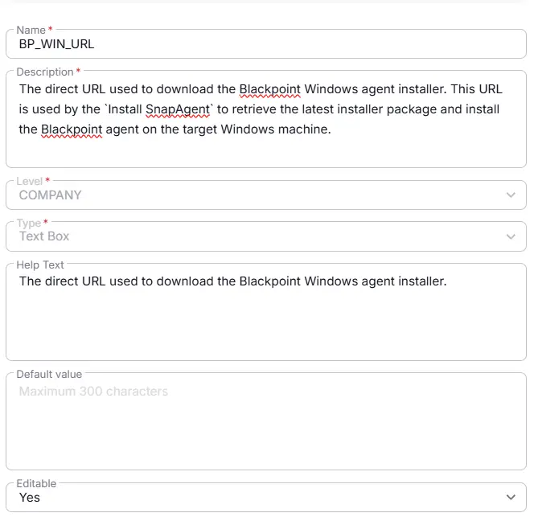

## Summary

The direct URL used to download the Blackpoint Windows agent installer. This URL is used by the `Install SnapAgent` to retrieve the latest installer package and install the Blackpoint agent on the target Windows machine.

## Details

| Name                 | Level                | Type                | Default       | Editable | Description      |   Help Text                     |
|----------------------|----------------------|--------|------------|------------------|----------|----------|
| BP_WIN_URL | Company| Text |-|  Yes  | The direct URL used to download the Blackpoint Windows agent installer. This URL is used by the `Install SnapAgent` to retrieve the latest installer package and install the Blackpoint agent on the target Windows machine. | The direct URL used to download the Blackpoint Windows agent installer.|

## Dependencies

- [Solution - BlackPoint SnapAgent Deployment](/docs/b99808e9-5148-47f6-9da4-bc4eeb590f2a) 

## Completed Custom Field

## Changelog

### 2026-08-18

- Initial version of the document