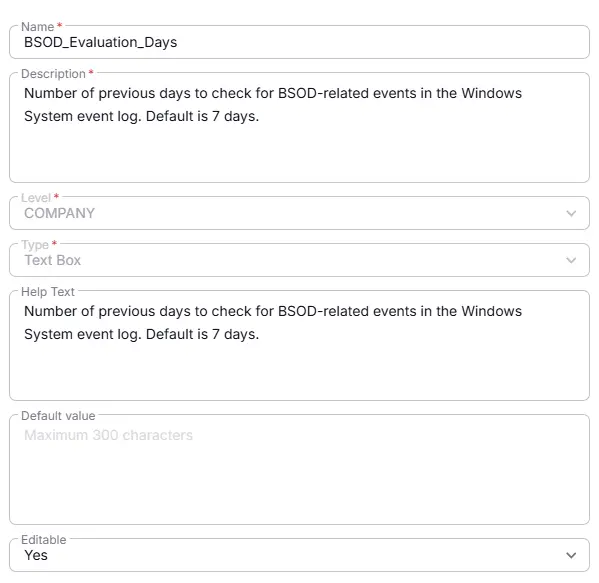

## Summary
Number of previous days to check for BSOD-related events in the Windows System event log. Default is 7 days.

## Details

| Name          | Level        | Type     |   Help Text           | Default       | Editable | Description                              |
|----------------------|----------|-----|----------|------------------|----------|---------|
| BSOD_Evaluation_Days | Company | Text |  Number of previous days to check for BSOD-related events in the Windows System event log. Default is 7 days. | - |  Yes  | Number of previous days to check for BSOD-related events in the Windows System event log. Default is 7 days. |

## Dependencies

- [Solution: BSOD Monitoring](/docs/fc85a090-94c2-4f91-8055-9c8e52d91ad1)

## Completed Custom Field

## Changelog

### 2026-07-14

- Initial version of the document