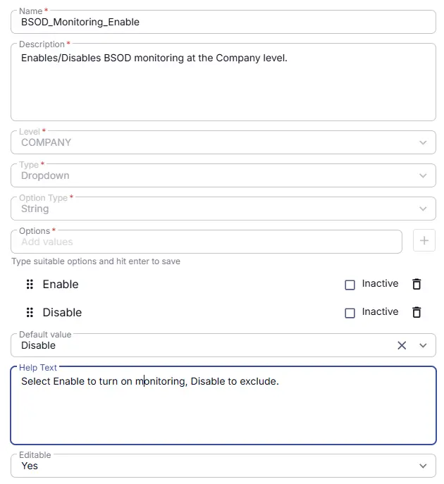

## Summary

Enables/Disables BSOD monitoring at the Company level.

## Details

| Name | Description | Level | Type | Option Type | Options | Help Text | Default Value | Editable |
|---|---|---|---|---|---|---|---|---|
| BSOD_Monitoring_Enable | Enables/Disables BSOD monitoring at the Company level. | `Company` | `Dropdown` | `string` | `Enable`, `Disable` | Select Enable to turn on monitoring, Disable to exclude. | `Disable` | `Yes` |

## Dependencies

- [Solution: BSOD Monitoring](/docs/fc85a090-94c2-4f91-8055-9c8e52d91ad1)

## Completed Custom Field

## Changelog

### 2026-07-21

- Initial version of the document