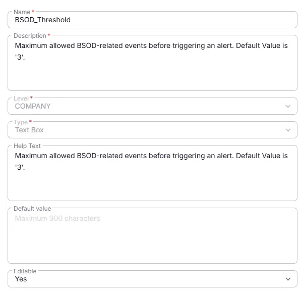

## Summary

Maximum allowed BSOD-related events before triggering an alert. Default Value is '3'.

## Details

| Name          | Level        | Type     |   Help Text           | Default       | Editable | Description                              |
|----------------------|----------|-----|----------|------------------|----------|---------|
| BSOD_Threshold | Company | Text | Maximum allowed BSOD-related events before triggering an alert. Default Value is '3'. | - |  Yes  | Maximum allowed BSOD-related events before triggering an alert. Default Value is '3'. |

## Dependencies

- [Solution: BSOD Monitoring](/docs/fc85a090-94c2-4f91-8055-9c8e52d91ad1)

## Completed Custom Field

## Changelog

### 2026-07-21

- Initial version of the document