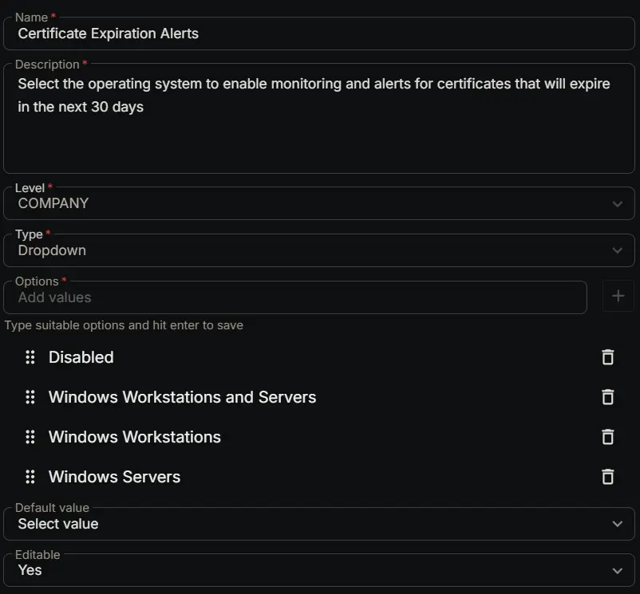

## Summary

Select the operating system to enable monitoring and alerts for certificates that will expire in the next 30 days.

## Dependencies

- [Solution: Certificate Expiration Monitoring](/docs/4712590e-18e7-47f7-a038-ab704f5859c2)

## Custom Field Setup Location

**Custom Fields Path:** `SETTINGS` ➞ `Custom Fields`  

## Details

| Name | Level | Type | Options | Default Value | Editable | Description |
| ---- | ----- | ---- | ------- | ------------ | -------- | ----------- |
| Certificate Expiration Alerts | COMPANY | DropDown | <ul><li>Disabled</li><li>Windows</li><li>Windows Workstations</li><li>Windows Servers</li></ul> | | Yes | Select the operating system to enable monitoring and alerts for certificates that will expire in the next 30 days. |

## Completed Custom Field

