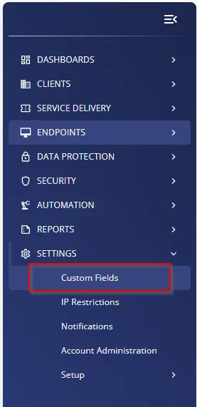
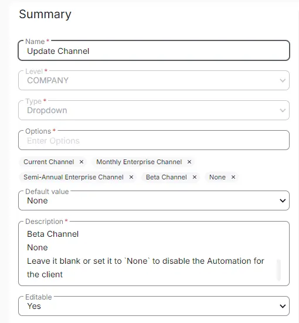

## Summary

Select the Update Channel from the drop-down menu to set for the client's computers. It is used by the [CW RMM - Task - Microsoft 365 - Click-to-Run - Set Update Channel](/docs/3627ba40-ca53-4583-8435-bb09bdb03f20).

Available options are:
- Current Channel
- Monthly Enterprise Channel
- Semi-Annual Enterprise Channel
- Beta Channel
- None

## Dependencies

[CW RMM - Solution - Microsoft 365 - Click-to-Run - Set Update Channel](/docs/b605b808-7016-4911-8c37-6b950de40919)

## Details

| Field Name         | Level   | Type      | Default Value | Description                                                                                                                                                                                                                                                                                                                                                     | Editable |
|--------------------|---------|-----------|---------------|-----------------------------------------------------------------------------------------------------------------------------------------------------------------------------------------------------------------------------------------------------------------------------------------------------------------------------------------------------------------|----------|
| Update Channel      | Company | Drop Down | None          | Select the Update Channel from the drop-down menu to set for the computer. Available options are: Current Channel, Monthly Enterprise Channel, Semi-Annual Enterprise Channel, Beta Channel, None. Computer Level EDF can be used to override the value set in the Client Level EDF.                                                                                 | Yes      |

