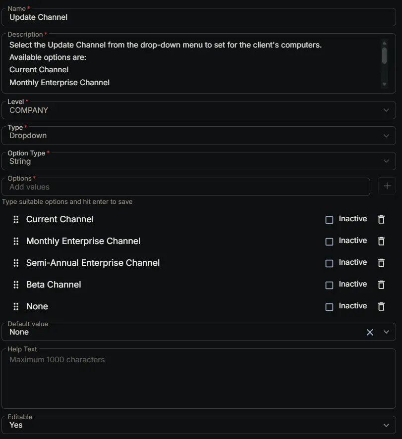

## Summary

Select the Update Channel from the drop-down menu to set for the client's computers. It is used by the [Microsoft 365 - Click-to-Run - Set Update Channel](/docs/3627ba40-ca53-4583-8435-bb09bdb03f20) task.

Available options are:

- Current Channel
- Monthly Enterprise Channel
- Semi-Annual Enterprise Channel
- Beta Channel
- None

## Dependencies

- [Solution - Microsoft 365 - Click-to-Run - Set Update Channel](/docs/b605b808-7016-4911-8c37-6b950de40919)

## Details

| Field Name         | Level   | Type      | Default Value | Description                                                                                                                                                                                                                                                                                                                                                     | Editable |
|--------------------|---------|-----------|---------------|-----------------------------------------------------------------------------------------------------------------------------------------------------------------------------------------------------------------------------------------------------------------------------------------------------------------------------------------------------------------|----------|
| Update Channel      | Company | Drop Down | None          | Select the Update Channel from the drop-down menu to set for the client's computer. Available options are: Current Channel, Monthly Enterprise Channel, Semi-Annual Enterprise Channel, Beta Channel, None. Computer Level custom field [Update Channel](/docs/772c0498-4505-4f1c-afc4-46788294b3e2) can be used to override the value set in this field. | Yes      |

## Changelog

### 2026-06-16

- Documentation

### 2025-04-10

- Initial version of the document
