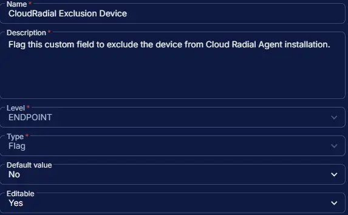

## Summary

Flag this custom field to exclude the device from Cloud Radial Agent deployment. However, the [Install CloudRadial Agent [Windows, Mac]](/docs/) task can still be run manually, independent of this field.

## Dependencies

- [Solution - CloudRadial Agent Deployment](/docs/)
- [Custom Field - CloudRadial Installation](/docs/e1ac886a-807a-4c85-9f6a-a1cecbc15910)

## Custom Field Setup Location

**Custom Fields Path:** `SETTINGS` ➞ `Custom Fields`

## Details

| Name | Level | Type | Options | Default Value | Editable | Description |
| ---- | ----- | ---- | ------- | ------------- | -------- | ----------- |
| CloudRadial Exclusion Device | Endpoint | Flag |  | No | Yes | Flag this custom field to exclude the device from Cloud Radial Agent deployment. |

## Completed Custom Field

