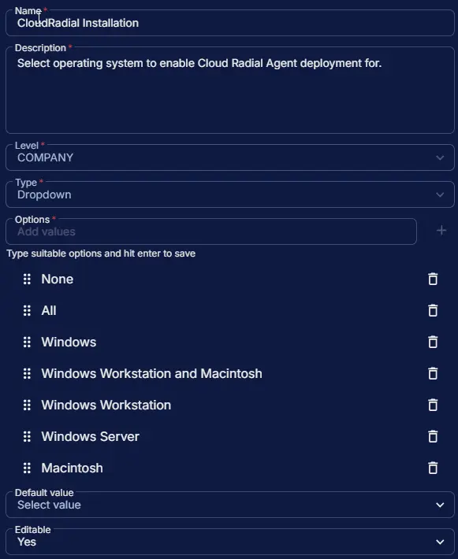

## Summary

Select operating system to enable Cloud Radial Agent deployment for. This custom field manages the auto-execution of the task. However, the [Install CloudRadial Agent [Windows, Mac]](/docs/76612d42-c62d-4d43-b7fd-227e350b420c) task can still be run manually, independent of this field.

## Dependencies

- [Solution - CloudRadial Agent Deployment](/docs/9e861bf3-2a05-46ef-9f7f-a46f33b675c5)

## Custom Field Setup Location

**Custom Fields Path:** `SETTINGS` ➞ `Custom Fields`

## Details

| Name | Level | Type | Options | Default Value | Editable | Description |
| ---- | ----- | ---- | ------- | ------------- | -------- | ----------- |
| CloudRadial Installation | COMPANY | Dropdown | <ul><li>None</li><li>All</li><li>Windows</li><li>Windows Workstation and Macintosh</li><li>Windows Workstation</li><li>Windows Server</li><li>Macintosh</li></ul> | | Yes | Select operating system to enable Cloud Radial Agent deployment for. |

## Completed Custom Field

