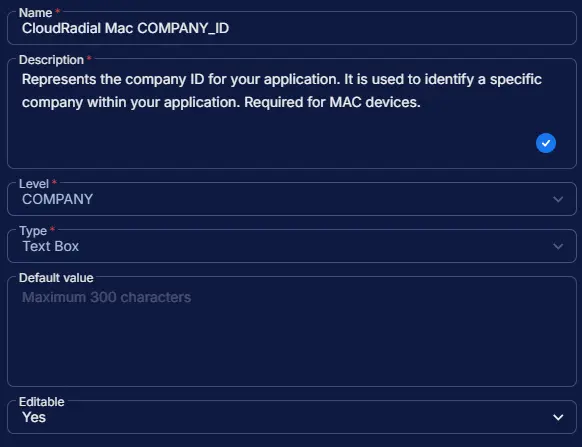

## Summary

Represents the company ID for your application. It is used to identify a specific company within your application. Required for MAC devices.

## Dependencies

- [Solution - CloudRadial Agent Deployment](/docs/)

## Custom Field Setup Location

**Custom Fields Path:** `SETTINGS` ➞ `Custom Fields`

## Details

| Name | Level | Type | Options | Default Value | Editable | Description |
| ---- | ----- | ---- | ------- | ------------- | -------- | ----------- |
| CloudRadial Mac COMPANY_ID | COMPANY | Text Box | | | Yes | Represents the company ID for your application. It is used to identify a specific company within your application. Required for MAC devices. |

## Completed Custom Field

