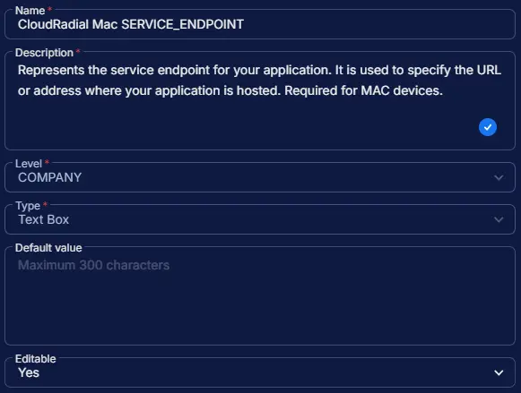

## Summary

Represents the service endpoint for your application. It is used to specify the URL or address where your application is hosted. Required for MAC devices.

## Dependencies

- [Solution - CloudRadial Agent Deployment](/docs/)

## Custom Field Setup Location

**Custom Fields Path:** `SETTINGS` ➞ `Custom Fields`

## Details

| Name | Level | Type | Options | Default Value | Editable | Description |
| ---- | ----- | ---- | ------- | ------------- | -------- | ----------- |
| CloudRadial Mac SERVICE_ENDPOINT | COMPANY | Text Box | | | Yes | Represents the service endpoint for your application. It is used to specify the URL or address where your application is hosted. Required for MAC devices. |

## Completed Custom Field

