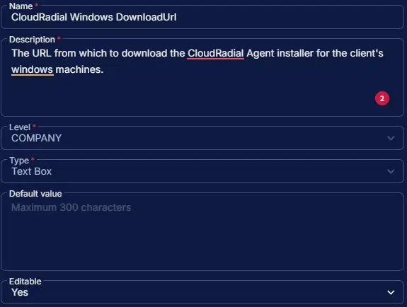

## Summary

The URL from which to download the CloudRadial Agent installer for the client's windows machines.

## Dependencies

- [Solution - CloudRadial Agent Deployment](/docs/)

## Custom Field Setup Location

**Custom Fields Path:** `SETTINGS` ➞ `Custom Fields`

## Details

| Name | Level | Type | Options | Default Value | Editable | Description |
| ---- | ----- | ---- | ------- | ------------- | -------- | ----------- |
| CloudRadial Windows DownloadUrl | COMPANY | Text Box | | | Yes | The URL from which to download the CloudRadial Agent installer for the client's windows machines. |

## Completed Custom Field

