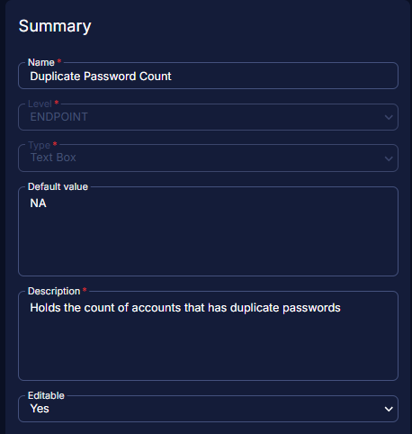

## Summary

This document holds the count of accounts with duplicate passwords.

## Dependencies

[CW RMM - Solution - Weak Passwords Audit](/docs/67f4ab8a-5eb0-49f6-ae41-4b3a308b1f11)

## Details

| Field Name               | Level    | Type    | Default Value | Description                                          | Editable |
|--------------------------|----------|---------|---------------|------------------------------------------------------|----------|
| Duplicate Password Count  | Endpoint | Textbox | NA            | Holds the count of accounts that have duplicate passwords | Yes      |

## Screenshot

