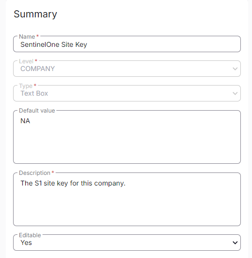

## Summary

This custom field at the company level stores the Sentinel Site Key. The Site Key is used for organizing and managing endpoints based on their physical or logical network location within the organization.

## Dependencies

[SentinelOne Deployment](/docs/e0abdce8-a697-43b1-a404-18168a616627)

## Details

| Field Name                | Level | Type     | Default Value | Description                      | Editable |
|---------------------------|-------|----------|---------------|----------------------------------|----------|
| SentinelOne Site Key      | Company  | TextBox  | NA            | The S1 site key for this company | Yes      |

## Screenshot

