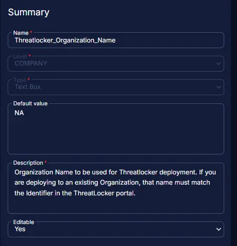

## Summary

This document specifies the organization name to be used for Threatlocker deployment. If deploying to an existing organization, the name must match the organization's name in the ThreatLocker portal.

## Dependencies

[CW RMM - Solution - Threatlocker Deployment](/docs/c9969bad-d2da-45ec-90fe-d6be82479ebc)

## Details

| Field Name                     | Level   | Type  | Default Value | Description                                                                                                                    | Editable |
|--------------------------------|---------|-------|---------------|-------------------------------------------------------------------------------------------------------------------------------|----------|
| Threatlocker_Organization_Name | Company | Text  | NA            | Organization name to be used for Threatlocker deployment. If deploying to an existing organization, the name must match the organization's name in the ThreatLocker portal. | Yes      |

## Screenshot

