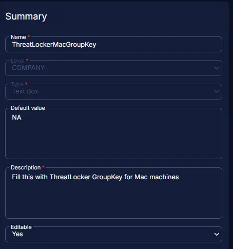

## Summary

This custom field at the company level stores the ThreatLocker Group key for Macintosh machines. Follow the instructions to obtain the group key for the desired machine. [MAC Agent Group Key Location | ThreatLocker Help Center (kb.help)](https://threatlocker.kb.help/mac-agent-group-key-location/)

## Dependencies

[CW RMM - Solution - ThreatLocker Deployment](/docs/c9969bad-d2da-45ec-90fe-d6be82479ebc)

## Details

| Field Name                | Level  | Type     | Default Value | Description                                 | Editable |
|---------------------------|--------|----------|---------------|---------------------------------------------|----------|
| ThreatLockerMacGroupKey   | Company| TextBox  | NA            | ThreatLocker Group key for Macintosh machines|          |

## Screenshot

